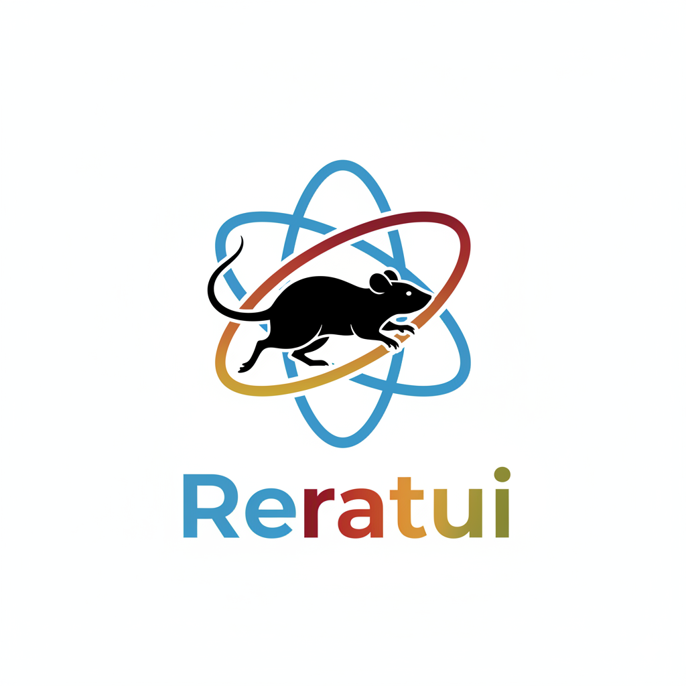

<div align="center">



# Reratui

**A Modern, Reactive TUI Framework for Rust**

[](https://crates.io/crates/reratui)
[](https://docs.rs/reratui)
[](https://github.com/sabry-awad97/reratui#license)
[](https://github.com/sabry-awad97/reratui/actions)

_Build beautiful, interactive terminal applications with React-inspired components and hooks_

[Getting Started](#quick-start) • [Documentation](#documentation) • [Examples](#examples) • [Contributing](#contributing)

</div>

---

## Overview

Reratui brings modern web development patterns to terminal user interfaces. Inspired by React, it provides a component-based architecture with hooks, enabling you to build complex, stateful TUI applications with clean, maintainable code.

### Why Reratui?

- 🎨 **Declarative UI** - Build interfaces with JSX-like syntax using the `rsx!` macro
- 🪝 **React-Style Hooks** - Manage state and side effects with familiar patterns
- ⚡ **High Performance** - Zero-cost abstractions with compile-time optimizations
- 🔒 **Type-Safe** - Leverage Rust's type system for compile-time correctness
- 🔄 **Async-First** - Built on Tokio with first-class async/await support
- 🧩 **Modular** - Compose complex UIs from simple, reusable components

## ✨ Features

<table>
<tr>
<td width="50%">

### 🏗️ Component System

- Component-based architecture with lifecycle hooks
- Reusable, composable components
- Type-safe props with `#[derive(Props)]`
- Automatic prop validation

</td>
<td width="50%">

### 🪝 Comprehensive Hooks

- State management (`use_state`, `use_reducer`)
- Side effects (`use_effect`, `use_async_effect`)
- Performance (`use_memo`, `use_callback`)
- Events (keyboard, mouse, resize)

</td>
</tr>
<tr>
<td width="50%">

### 🎯 Developer Experience

- JSX-like `rsx!` macro syntax
- Compile-time hook rules validation
- Comprehensive error messages
- Hot-reload support (coming soon)

</td>
<td width="50%">

### ⚡ Performance

- Zero-cost abstractions
- Compile-time macro expansion
- Efficient event handling
- Minimal runtime overhead

</td>
</tr>
</table>

<details>
<summary><b>📚 Complete Hooks Reference</b> (click to expand)</summary>

<br/>

| Category        | Hook                      | Description                                    |
| --------------- | ------------------------- | ---------------------------------------------- |
| **State**       | `use_state`               | Local component state management               |
|                 | `use_reducer`             | Complex state logic with actions (Redux-style) |
|                 | `use_ref`                 | Mutable references that persist across renders |
| **Effects**     | `use_effect`              | Side effects with dependency tracking          |
|                 | `use_effect_once`         | Run effect only on mount                       |
|                 | `use_async_effect`        | Async side effects with cleanup                |
| **Performance** | `use_callback`            | Memoized callbacks to prevent re-renders       |
|                 | `use_memo`                | Memoized computed values                       |
|                 | `use_effect_event`        | Stable event handlers with latest values       |
| **Context**     | `use_context`             | Access shared data without prop drilling       |
|                 | `use_context_provider`    | Provide context values to children             |
| **Events**      | `use_event`               | Generic terminal event handling                |
|                 | `use_keyboard`            | Keyboard events with stable callbacks          |
|                 | `use_keyboard_press`      | Handle key press events only                   |
|                 | `use_keyboard_shortcut`   | Specific key combinations                      |
|                 | `use_mouse`               | Mouse events with stable callbacks             |
|                 | `use_mouse_click`         | Handle mouse click events                      |
|                 | `use_mouse_drag`          | Track drag operations                          |
|                 | `use_double_click`        | Detect double-click gestures                   |
|                 | `on_global_event`         | Global keyboard event handlers                 |
| **Layout**      | `use_frame`               | Frame timing and render context                |
|                 | `use_area`                | Component's rendering area                     |
|                 | `use_on_resize`           | Handle terminal resize events                  |
|                 | `use_terminal_dimensions` | Current terminal size                          |

</details>

## 🚀 Installation

Add Reratui to your `Cargo.toml`:

```toml
[dependencies]
reratui = "0.1.0"
tokio = { version = "1", features = ["full"] }
```

> **Note:** The main `reratui` crate re-exports all necessary functionality. You typically don't need to add individual sub-crates.

## 📖 Quick Start

### Your First Component

```rust
use reratui::prelude::*;

#[component]
fn Counter() -> Element {
    let (count, set_count) = use_state(|| 0);

    // Handle keyboard events
    if let Some(Event::Key(key)) = use_event()
        && key.is_press()
    {
        match key.code {
            KeyCode::Char('j') => set_count.update(|n| n + 1),
            KeyCode::Char('k') => set_count.update(|n| n - 1),
            KeyCode::Char('r') => set_count.set(0),
            _ => {}
        }
    }

    rsx! {
        <Block
            title="Counter Demo"
            borders={Borders::ALL}
            border_style={Style::default().fg(Color::Cyan)}
        >
            <Paragraph alignment={Alignment::Center}>
                {format!("Count: {}", count.get())}
            </Paragraph>
            <Paragraph alignment={Alignment::Center}>
                {"Press 'j' to increment, 'k' to decrement, 'r' to reset"}
            </Paragraph>
        </Block>
    }
}

#[reratui::main]
async fn main() -> Result<()> {
    render(|| rsx! { <Counter /> }).await?;
    Ok(())
}
```

### Component with Props

```rust
use reratui::prelude::*;

#[derive(Props)]
struct ButtonProps {
    label: String,
    on_click: Option<Callback<()>>,
}

#[component]
fn Button(props: &ButtonProps) -> Element {
    rsx! {
        <Block borders={Borders::ALL}>
            <Paragraph alignment={Alignment::Center}>
                {format!("[ {} ]", props.label)}
            </Paragraph>
        </Block>
    }
}

#[component]
fn App() -> Element {
    let (clicks, set_clicks) = use_state(|| 0);

    rsx! {
        <Layout direction={Direction::Vertical}>
            <Button
                label={format!("Clicked {} times", clicks.get())}
                on_click={move |_| set_clicks.update(|n| n + 1)}
            />
        </Layout>
    }
}
```

## 🎓 Advanced Usage

### Complex State with Reducers

```rust
use reratui::prelude::*;

#[derive(Clone)]
enum TodoAction {
    Add(String),
    Toggle(usize),
    Remove(usize),
}

#[derive(Clone)]
struct TodoState {
    todos: Vec<Todo>,
    next_id: usize,
}

fn todo_reducer(state: TodoState, action: TodoAction) -> TodoState {
    match action {
        TodoAction::Add(text) => TodoState {
            todos: {
                let mut todos = state.todos;
                todos.push(Todo { id: state.next_id, text, completed: false });
                todos
            },
            next_id: state.next_id + 1,
        },
        TodoAction::Toggle(id) => TodoState {
            todos: state.todos.into_iter().map(|mut todo| {
                if todo.id == id {
                    todo.completed = !todo.completed;
                }
                todo
            }).collect(),
            ..state
        },
        TodoAction::Remove(id) => TodoState {
            todos: state.todos.into_iter().filter(|t| t.id != id).collect(),
            ..state
        },
    }
}

#[component]
fn TodoApp() -> Element {
    let (state, dispatch) = use_reducer(
        todo_reducer,
        TodoState { todos: vec![], next_id: 1 }
    );

    // Use state and dispatch in your component...
}
```

### Context for Global State

Share state across components without prop drilling:

```rust
#[component]
fn App() -> Element {
    let theme = use_context_provider(|| Theme::Dark);

    rsx! {
        <Layout>
            <Header />
            <Content />
        </Layout>
    }
}

#[component]
fn Header() -> Element {
    let theme = use_context::<Theme>();
    // Use theme...
}
```

## 🏛️ Architecture

Reratui follows a modular, layered architecture with clear separation of concerns:

```
┌─────────────────────────────────────────────┐
│           reratui (Main Crate)              │  ← Public API
├─────────────────────────────────────────────┤
│  reratui-macro  │  reratui-hooks            │  ← Developer Tools
├─────────────────────────────────────────────┤
│  reratui-core   │  reratui-runtime          │  ← Core Engine
├─────────────────────────────────────────────┤
│         reratui-ratatui (Backend)           │  ← Rendering
└─────────────────────────────────────────────┘
```

### Crate Structure

| Crate             | Purpose                                       |
| ----------------- | --------------------------------------------- |
| `reratui`         | Main crate - re-exports all functionality     |
| `reratui-core`    | Core types (Element, Component, VNode)        |
| `reratui-macro`   | Procedural macros (#[component], rsx!, Props) |
| `reratui-hooks`   | Hook implementations and state management     |
| `reratui-runtime` | Event loop, lifecycle, and rendering runtime  |
| `reratui-ratatui` | Ratatui backend integration                   |

### Design Principles

| Principle       | Implementation                                                     |
| --------------- | ------------------------------------------------------------------ |
| **SOLID**       | Single responsibility, interface segregation, dependency inversion |
| **DDD**         | Clear domain boundaries with well-defined interfaces               |
| **Composition** | Build complex UIs by composing simple components                   |
| **Type Safety** | Leverage Rust's type system for compile-time correctness           |
| **Zero-Cost**   | No runtime overhead for abstractions                               |

## 💡 Examples

Explore complete, runnable examples in the [`examples/`](./examples) directory:

| Example             | Description                                       | Command                               |
| ------------------- | ------------------------------------------------- | ------------------------------------- |
| **counter**         | Basic state management and keyboard events        | `cargo run --example counter`         |
| **rsx_demo**        | Comprehensive RSX macro features                  | `cargo run --example rsx_demo`        |
| **events_showcase** | Complete event handling (keyboard, mouse, resize) | `cargo run --example events_showcase` |
| **router**          | Navigation and routing                            | Coming soon                           |

## 📚 Documentation

| Resource                                     | Description                          |
| -------------------------------------------- | ------------------------------------ |
| [**API Docs**](https://docs.rs/reratui)      | Complete API reference with examples |
| [**Examples**](./examples)                   | Working code examples and demos      |
| [**Hooks Guide**](./docs/hooks.md)           | Detailed hook usage patterns         |
| [**Component Patterns**](./docs/patterns.md) | Best practices and design patterns   |

## 🔧 Requirements

**Minimum Supported Rust Version (MSRV): 1.75.0**

Required for:

- `let`-`else` statements
- `let` chains in `if` expressions
- Edition 2024 features

## 🤝 Contributing

We welcome contributions! See our [Contributing Guide](./CONTRIBUTING.md) for:

- 📜 Code of conduct
- 🛠️ Development setup
- ✅ Testing requirements
- 🔄 Pull request process

## 🗺️ Roadmap

### ✅ Completed

- [x] Core component system with lifecycle hooks (`on_mount`, `on_unmount`)
- [x] Comprehensive hooks system (state, effect, reducer, context)
- [x] RSX macro with conditional rendering
- [x] Hook rules validation at compile-time
- [x] Event handling (keyboard, mouse, resize)
- [x] Global event system for application-wide shortcuts

### 🚧 In Progress

- [ ] Router with nested routes
- [ ] Form validation helpers
- [ ] Animation system

### 📋 Planned

- [ ] Dev tools and debugging utilities
- [ ] Performance profiling tools
- [ ] Hot-reload support
- [ ] Component testing utilities

## 📄 License

Dual-licensed under your choice of:

- **Apache License 2.0** ([LICENSE-APACHE](LICENSE-APACHE) or http://www.apache.org/licenses/LICENSE-2.0)
- **MIT License** ([LICENSE-MIT](LICENSE-MIT) or http://opensource.org/licenses/MIT)

Unless explicitly stated otherwise, any contribution intentionally submitted for inclusion shall be dual licensed as above, without additional terms or conditions.

---

## 🙏 Acknowledgments

Reratui stands on the shoulders of giants:

- **[Ratatui](https://github.com/ratatui-org/ratatui)** - The powerful TUI library that powers our rendering
- **[React](https://react.dev/)** - Inspiration for component architecture and hooks patterns
- **[Yew](https://yew.rs/)** - Rust web framework with similar design patterns

---

<div align="center">

**Built with ❤️ by the Rust community**

[⭐ Star us on GitHub](https://github.com/sabry-awad97/reratui) • [📖 Read the Docs](https://docs.rs/reratui) • [💬 Join Discussions](https://github.com/sabry-awad97/reratui/discussions)

</div>
